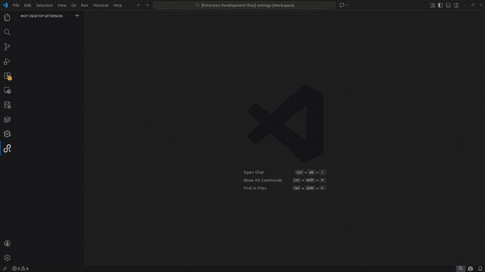
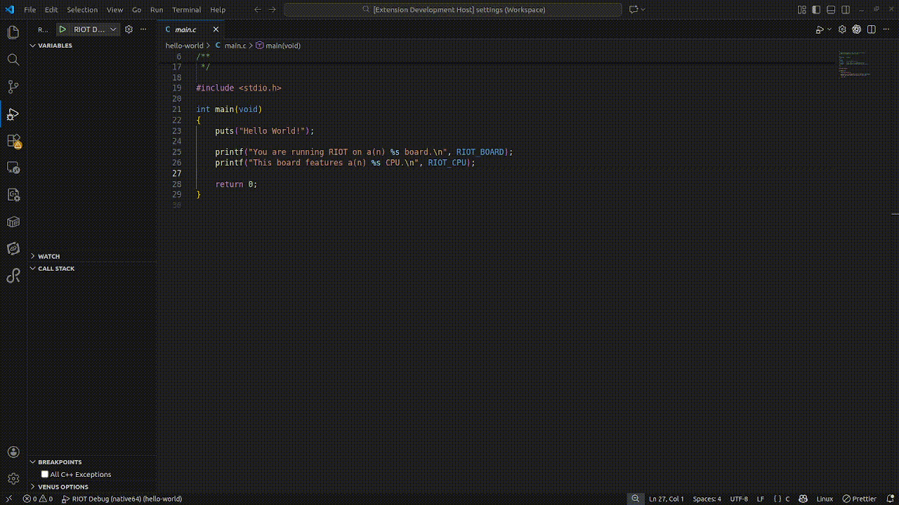

# RIOT-Extension README

This extension aims to facilitate your RIOT-OS workflow by integrating essential make commands directly into the VS Code UI.

**Note**: This is currently a beta version. We appreciate your feedbuck to help us improve the extension before the final release in late February/early March. Additionally, some new UI changes have been staged that diverge from the GIFs down below. Regardless, there have been no changes in the usage of the features themselves.

## Features

Open the **RIOT-View** by clicking on the RIOT-icon in the activity bar to access the following features:

0. Adding devices
    <ul>
        <li>Click the <b>+-icon</b> to add a new device</li>
        <li>Select your board from all currently supported RIOT boards via the dropdown menu</li>
        <li>Select your application folder via the file dialog</li>
    </ul>
1. Flashing Applications
    Once your board and application are configured, hover over the device name and click the **Flash-icon** to build and flash your code.

2. Using board's Terminal
    Click the **Terminal-icon** next to the previously mentioned flash-symbol to communicate via the serial connection. 
    <ul><li>Note: Make sure your application is flashed before opening the terminal</li></ul>

3. Recognizing Serial Port that are in Use
    Used ports are automatically detected and listed in the serial port dropdown menu. You can also manually enter a port or select 'None' if not required (which is mostly the case).

4. Compile Commands and configuring VS-Code's IntelliSense
    As soon as you select a board and an application, the extension automatically generates compile commands. This allows VS Code to resolve 'includes' and provides full IntelliSense support.

5. Debug on Native and Embedded
    You can debug on native (host) or your external board which requires an **On-Chip-Debugger** 
    <ul>
        <li>Flash the application</li>
        <li>Set a breakpoint in your code</li>
        <li>Press the <b>Bug-icon</b> in your tree view</li>
    </ul>
    (If debugging fails, please check the **Known Issues** section below.)

6. Saving configured Devices
    Your set up devices are automatically saved. When you reopen VS Code, your setup will be restored exactly as you left it.

## Requirements

OS: Linux or WSL are required since there is no gurantee that **make** or **gdb-multiarch** works on Windows installations.

The C/C++-Extension from Microsoft is also required.

## Extension Settings

There are no particular extension settings you have to adjust so far.

## Known Issues

This is just a beta version and some features, especially the debugger, work on bleeding edge.

1. 'Compile-commands' only works for one device simultaniously. It executes automatically when a device's applicationa and board are configured. We plan to add an additional button for this in the future.

2. If you stop debugging without using the **Stop**-button (red squre or Shift + F5), the OpenOCD server might keep running as a zombie process in the background which prevents new debug sessions. To fix this, please run **pkill openocd** or **killall openocd** in your terminal.
3. Sometimes the extension fails to detect the required **.ELF**-file if the name varies from the expected one. You can manually fix the path in the generated **.vscode/launch.json** file according to the actual file name under **bin/your-board/debug-file.elf**.

## Release Notes

The official release is planned in a couple months. Until then we are grateful for everyone using and testing the features and sharing your feedback on GitHub or the RIOT forum. Please let us know if you are missing some features or come up with other ideas that could be covered by this extension. This is vital for providing the best experience for RIOT veterans and newcomers!