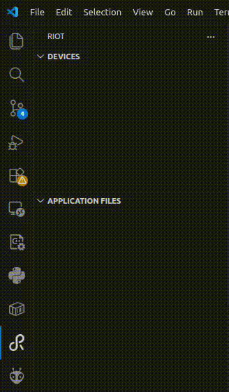
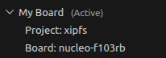
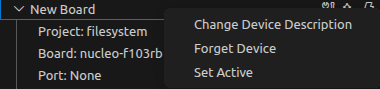
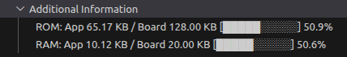
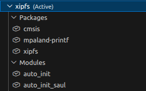
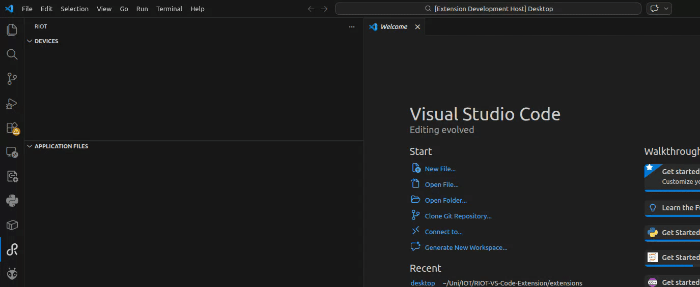

# RIOT-Extension README

This extension streamlines your RIOT-OS development workflow by integrating essential make commands directly into the VS Code UI. It leverages RIOT's native make-based build system to provide a seamless integration.

**Note**: Although this extension has been officially released, we welcome your feedback regarding bugs, missing features, or suggestions for improvement.

## Features

Open the **RIOT-View** by clicking on the RIOT-icon in the activity bar to access the following features:

1. Adding Devices
    <ul>
        <li>Click the <b>+-icon</b> to add a new device</li>
        <li>Select your board from all currently supported RIOT boards via the dropdown menu</li>
        <li>Select your application folder via the file dialog</li>
        <li>Every assigned application of a device will opened in the file view below respectively
        <li>Selecting the Serial Port is optional in most cases since the Make build system finds the board by its hardware and manufacturer information </li>
    </ul>

    
2. Compile Commands and VS Code IntelliSense Configuration </br>
   Once you select a board and an application, the extension automatically generates a compile_commands.json file. This is indicated by a terminal window that opens to execute the generation process. <br>
   From this point on, your configuration is marked as **Active**, meaning that the compile_commands.json file now reflects your selected application. This enables VS Code to resolve #include directives and provides full IntelliSense support, including features like autocompletion and symbol navigation.

     
    
    You can select your Active Device by right-clicking it in the context menu. This action triggers the regeneration of the compile_commands.json file to ensure your IntelliSense configuration is up to date.

    

    Additionally, the linked **RIOT base directory** will be displayed in a secondary explorer view beneath the application view.
3. Flashing Applications </br>
    Once your board and application are configured, hover over the device name and click the **Flash-icon** to build and flash your code.

4. Using board's Terminal
    Click the **Terminal-icon** next to the previously mentioned flash-symbol to communicate via the serial connection.</br>
    <ul><li>Note: Make sure your application is flashed before opening the terminal</li></ul>

5. Using **clean** and **build** </br>
    The clean and build commands follow the same usage patterns as the term and flash commands. You can trigger them through the same UI elements used for flashing and monitoring.

6. Monitoring Memory Usage
    <ul>
        <li>Once a device is set to <b>Active</b>, the extension automatically identifies the board's total memory capacity.</li>
        <li>After building the assigned application, the required static RAM and ROM usage is calculated.</li>
        <li>Once both conditions are met, a progress bar under <b>Additional Information</b> displays the percentage of memory utilized.</li>
    </ul>


Please note that the Application File View is a custom Tree View implementation tailored to the RIOT-OS project structure. Because this is a specialized view rather than the native VS Code File Explorer, certain standard context menu features may currently be missing.</br>
**Workaround**: If you require the full range of standard file operations, you can still access all project files through the default VS Code Explorer.

7. View Application Modules and Packages </br>
    Once a device is set to Active, the explorer view below the application tree will display two nodes that list the modules and packages assigned to the application.</br>
    

8. Create RIOT Projects </br>
    If **riotgen** is installed on your system, clicking the **RIOT Create Project** button opens a wizard that guides you through the required configuration fields.



9. Debug on Native and Embedded
    You can debug on native (host) or your external board which requires an **On-Chip-Debugger**</br>
    <ul>
        <li><b>Flash</b> the application</li>
        <li>Set a <b>breakpoint</b> in your code</li>
        <li>Press the <b>Bug-icon</b> in your tree view</li>
    </ul>
    (If debugging fails, please check [this](#potential-debugger-issues) section below.)


10. Saving configured Devices
    Your set up devices are automatically saved. When you reopen VS Code, your setup will be restored exactly as you left it.


## Requirements

OS: Linux or WSL are required since there is no gurantee that **make** or **gdb-multiarch** works on Windows installations.

The **C/C++-Extension** from Microsoft is also required.

**pip** is required in order to install the tool [riotgen](#riotgen-usage).

## Debugging with GDB
The debugging process relies on an external debug server (e.g., OpenOCD) that listens on TCP ports 3333, 4444, and 5555. These ports are automatically incremented based on the number of active debugging sessions.</br>

Simultaneously, the extension generates the necessary metadata for the C/C++ debugger, connects to the launched debug server, and starts the application until the initial breakpoint is reached.
### Troubleshooting
If the debug server terminal displays the following error:
<br>
```
Error: Failed to claim interface: LIBUSB_ERROR_BUSY.
Error: Failed to open device: unspecified error.
Error: No J-Link device found.
```
<br>
There is likely a zombie process from a previous session that did not terminate correctly and is now blocking the USB port. You can resolve this in three ways:

1. Run **pkill openocd** or **killall openocd** in your terminal.

2. Unplug your device and plug it back in.

3. Reset your board if your hardware supports a physical reset button.<br>

If a VS Code dialog appears with the message:
```launch: program your/program/path does not exist```</br>
This usually means the binary has not been built yet. Ensure that you have **compiled and flashed** the application properly beforehand. The same applies if the debug server reports:</br>
Same applies for the debug-server saying: 
```target not examined yet```

## Extension Settings

[!IMPORTANT]
**Active Workspace Required:** Please ensure that at least one workspace folder is open while using this extension. The extension relies on workspace-specific states to manage configurations. If no folder is open in the Explorer, the extension may not function correctly or exhibit unexpected behavior.

## Known Issues
Described in [Extension Settings](#extension-settings).


## Riotgen Usage

To create your own RIOT applications, this extension leverages [riotgen](https://github.com/aabadie/riot-generator) under the hood. It is a powerful open-source tool, and we highly recommend exploring the additional features this CLI provides.

## Release Notes

Future releases will be published via the official **RIOT-OS account** on the VS Code Marketplace. This project is open-source; we encourage the community to fork the repository and contribute to its ongoing development.

## Used Make Commands
For transparency, the make and shell commands utilized by this extension are listed below. If the extension stops functioning after a new RIOT release, it may be because a command has been updated or deprecated. </br>
 ```make -C "path/to/app" all BOARD=boardId PORT=/dev/port```</br>
 ```make -C "path/to/app" clean BOARD=boardId PORT=/dev/port```</br>
```make -C "path/to/app" flash BOARD=boardId PORT=/dev/port``` </br>
```make -C "path/to/app" term BOARD=boardId PORT=/dev/port``` </br>
```make -C "path/to/app" debug-server GDB_PORT=3333 TELNET_PORT=4444 TCL_PORT=5555 BOARD=boardId PORT=/dev/port ```</br>
```make -C "path/to/app" compile-commands BOARD=boardId PORT=/dev/port```</br>
```make info-buildsize BOARD=boardId ```</br>
```make info-debug-variable-RAM_LEN BOARD=boardId```</br>
```make info-debug-variable-ROM_LEN BOARD=boardId```</br>
```make info-debug-variable-APPLICATION```</br>
```make info-debug-variable-RIOTBASE```</br>
```make info-modules```</br>
```make info-packages```</br>
```make info-boards```</br>


## Other Used Bash Commands

``` cd path/to/app ```</br>
``` mkdir path/to/app```</br>
``` lsof -i 1234 -t ```</br>
``` kill -0 12345 ```</br>
``` pip install riotgen ```</br>
``` riotgen --version ```</br>
``` openocd --version ```</br>
``` gdb-multiarch --version ```</br>
``` git clone https://github.com/RIOT-OS/RIOT.git path/to/app ```</br> 